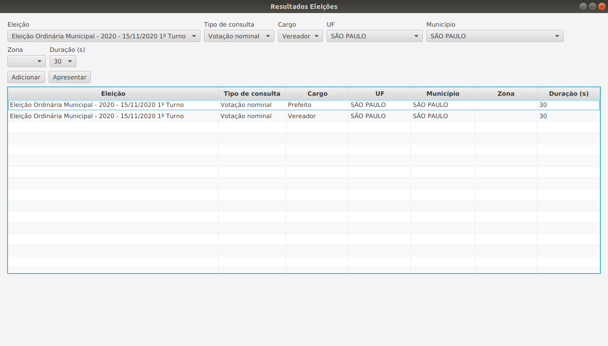
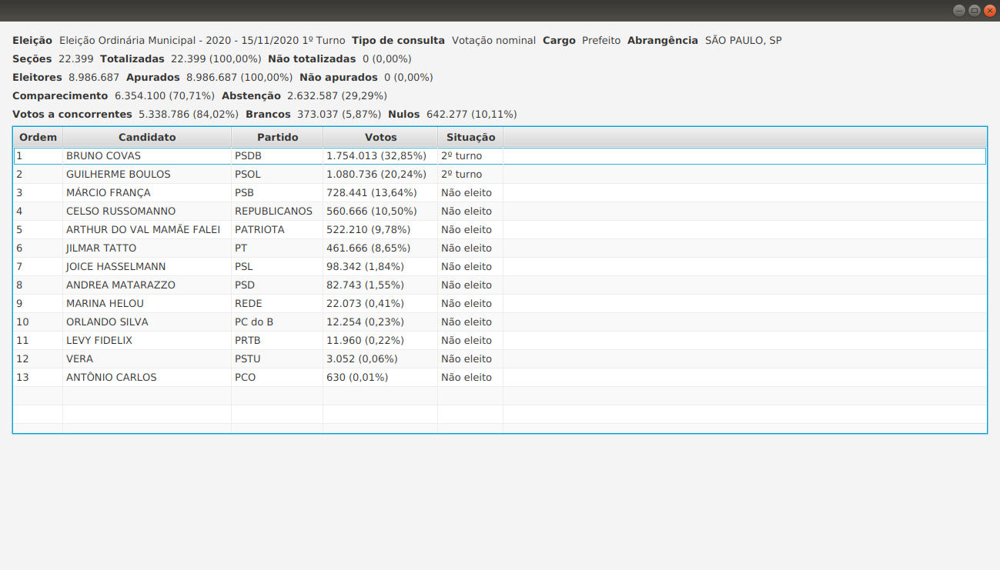

# Resultados Eleições

Resultados Eleições é um aplicativo para acompanhar os resultados das eleições brasileiras em tempo real.

**O aplicativo exibe os resultados das eleições de 2020, mas esta é uma versão inicial e o lançamento da 1ª versão está
previsto para 2022.**

## Instalação

O aplicativo é compatível com os sistemas operacionais Windows, macOS e Linux. Para utilizá-lo, siga estes passos:

1. [Instale o ambiente de desenvolvimento integrado IntelliJ IDEA][instalar-intellij] (Community ou Ultimate).
1. [Importe o projeto no IntelliJ IDEA][importar].
1. [Execute a aplicação][executar].

[instalar-intellij]: https://www.jetbrains.com/pt-br/idea/download

[importar]: https://www.jetbrains.com/help/idea/import-project-or-module-wizard.html#Import_Project_or_Module_Wizard-0-for-1-chapter

[executar]: https://www.jetbrains.com/help/idea/running-applications.html

## Utilização

Na tela principal, você deve selecionar a consulta e a duração da apresentação dos resultados da consulta. Então, clique
em **Adicionar**.

As consultas selecionadas são exibidas na tabela. Após selecionar todas as consultas desejadas, clique em **Apresentar**
.

Uma nova janela será aberta. Os resultados de cada consulta serão exibidos pela duração definida anteriormente, na ordem
em que as consultas foram selecionadas e de forma cíclica. Os resultados serão atualizados automaticamente.

Exemplo:

É possível que os resultados não sejam exibidos no 1º ciclo. Aguarde o início do próximo ciclo.

### Limitações

O aplicativo não exibe os resultados de eleições arquivadas pelo Tribunal Superior Eleitoral.

## Desenvolvimento

O aplicativo é desenvolvido com a linguagem de programação Kotlin e a biblioteca gráfica JavaFX. Veja todas as
dependências no arquivo [build.gradle.kts](build.gradle.kts).

### Desenvolvedor

O aplicativo é desenvolvido por Marcelo Henrique Bittencourt ([GitHub][github], [LinkedIn][linkedin]).

[github]: https://github.com/bittencourtmh

[linkedin]: https://linkedin.com/in/bittencourtmh

## Licença

O aplicativo está licenciado sob a [GNU Affero General Public License v3.0](LICENSE).
